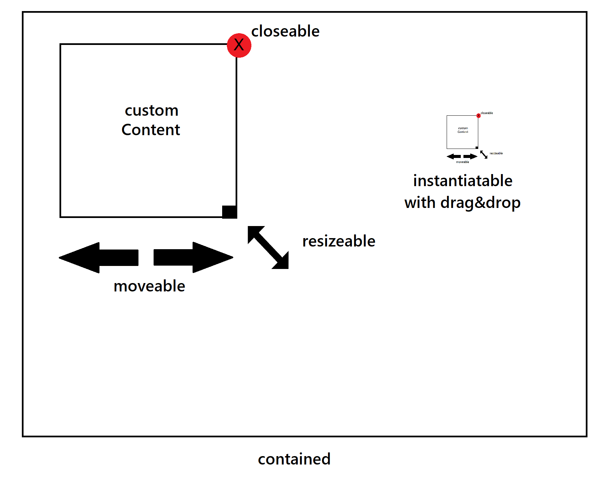

# SVG Widget Library

A flexible React-based library for creating and managing interactive SVG widgets.

Widgets are movable, resizable, and deletable within an SVG area. Widgets can be customized using a render function that receives the widget's state and returns the widget's content. Widgets can also be drag-and-dropped to a new position within the SVG area. The library automatically adjusts the dimensions of the SVG area to fit the widgets within it.




## Features

- Dynamic creation, positioning, and resizing of widgets within an SVG area
- Mobile and tablet compatibility
- Customizable widget rendering
- Drag-and-drop functionality
- Interactive elements (resize, delete)
- Responsive design with automatic dimension adjustments

## Installation

simply copy the js file to your project and import it in your component.

## Usage

Here's a basic example of how to use the SVG Widget Library

```jsx
import React from 'react';
import { SvgArea, SvgAreaWidget } from 'SvgArea';

const App = () = {
  const renderWidget = (id, key, props) = {
    return (
      SvgAreaWidget {...props}
        { Your custom widget content here }
        text x=10 y=20Hello, Widget!text
      SvgAreaWidget
    );
  };

  return (
    SvgArea
      renderWidget={renderWidget}
      onAddWidget={(widget) = {
         Customize newly added widgets here
        return widget;
      }}
    
      { Your SVG content here }
      rect width=100% height=100% fill=#f0f0f0 
    SvgArea
  );
};

export default App;
```

## API Reference

### SvgArea

Main component that creates the SVG area and manages widgets.

Props
- `renderWidget` (required) Function to render individual widgets
- `onAddWidget` (optional) Function to customize newly added widgets
- `getInitialWidgets` (optional) Function to provide initial widgets
- `onUnmount` (optional) Function called when component unmounts

### SvgAreaWidget

Component for individual widgets within the SVG area.

Props
- `state` (required) Object containing widget state (x, y, width, height)
- `setState` (required) Function to update widget state
- `deleteWidget` (required) Function to delete the widget
- `fixed` (optional) Boolean to make widget position fixed
- `proportional` (optional) Boolean to maintain widget aspect ratio when resizing

## Contributing

Contributions are welcome! Please feel free to submit a Pull Request.

## License

This project is licensed under the MIT License.